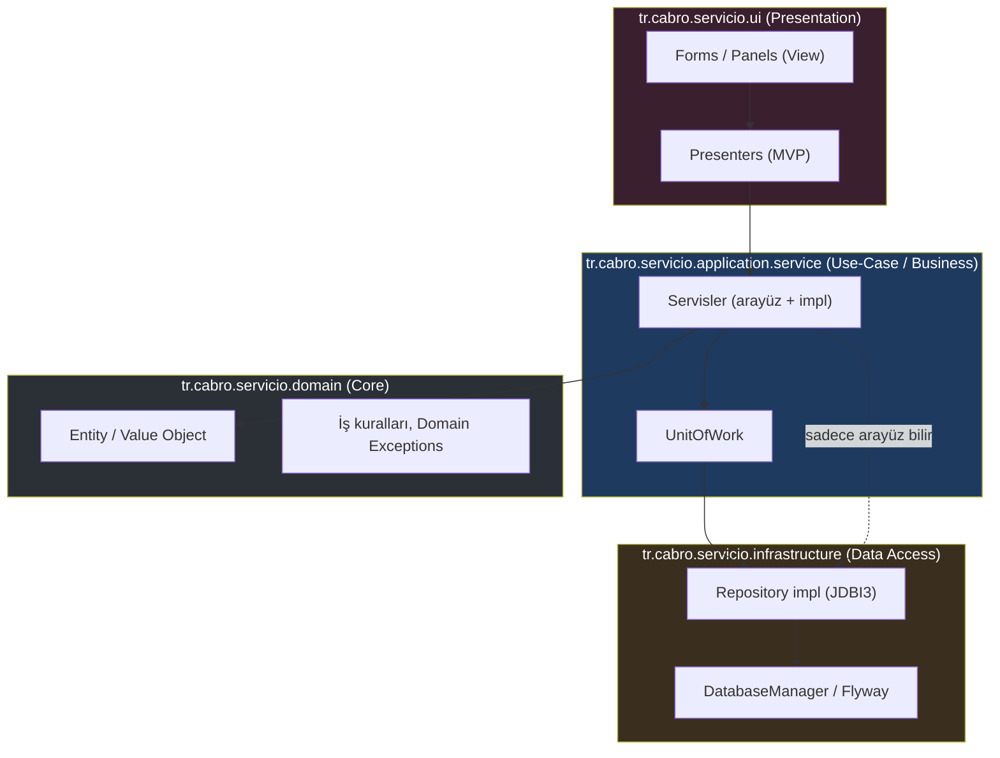
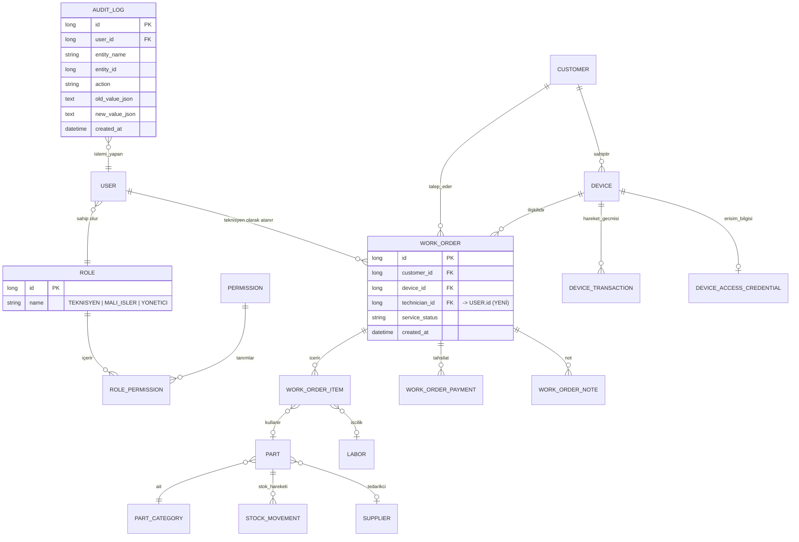
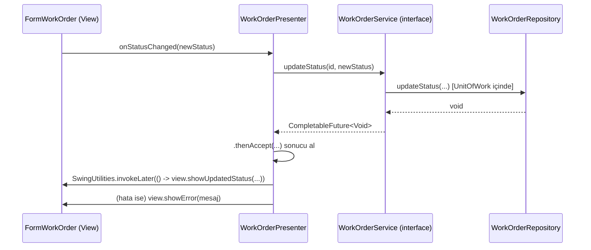
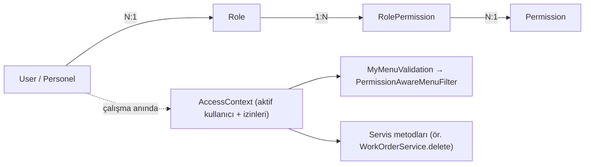

# Servicio — Kurumsal Mimari Dönüşüm Planı

**Rol:** Kıdemli Yazılım Mimarı değerlendirmesi
**Kapsam:** `tr.cabro.servicio` — Java 21 / Swing (FlatLaf, MigLayout) masaüstü Teknik Servis Kayıt uygulaması
**Yöntem:** Sıfırdan yazım değil — mevcut kod tabanı üzerinde adım adım (incremental) refactoring

---

## 0. Mevcut Durum Tespiti (Codebase Analizi)

Planı somutlaştırmadan önce gerçek kod tabanından çıkarılan tespitler:

| Alan | Bulgu | Değerlendirme |
|---|---|---|
| Katmanlar | `model/`, `database/repository/` (JDBI3 SqlObject arayüzleri), `service/`, `application/` (UI) paketleri zaten ayrılmış | ✅ İyi bir temel var — sıfırdan başlamaya gerek yok |
| Repository | `WorkOrderRepository` gibi arayüzler JDBI3 `@SqlObject` ile tanımlı, dinamik proxy üretiliyor | ✅ Repository Pattern zaten fiilen uygulanmış |
| DI / Bağımlılık Yönetimi | `ServiceManager` (`service/ServiceManager.java`) tüm servisleri `static` alanlarda tutuyor; UI, `ServiceManager.getWorkOrderService()` ile doğrudan erişiyor (`FormWorkOrder:69`) | ❌ Statik Service Locator anti-pattern — test edilemez, gizli bağımlılık |
| Veritabanı erişimi | `DatabaseManager` tamamen `static` metodlarla HikariCP + JDBI kurulumu yapıyor | ❌ Statik singleton, IoC container yok |
| Transaction yönetimi | `WorkOrderService.saveNew()` cihazı ve iş emrini **iki ayrı** `CompletableFuture` zincirinde, **tek transaction olmadan** kaydediyor | ❌ Kısmi hata durumunda tutarsız veri riski (orphan device) |
| Servis arayüzleri | Servisler (`WorkOrderService`, `CustomerService`, …) somut sınıf; arayüz yok | ❌ DIP ihlali, mock'lanamaz |
| Kimlik/Yetki | `User` modeli tek "işletme sahibi" profili; `UserService.authenticate(String pin)` — PIN tabanlı **tek kullanıcı** girişi | ❌ Çoklu kullanıcı / rol kavramı yok |
| Menü yetkilendirme | `MyMenuValidation` — üçüncü parti UI şablonundan kalma, index bazlı hardcoded gizleme (`{2,0}`, `{2,1}`…) | ❌ Gerçek yetkilendirme değil, demo kod artığı |
| Migration | Flyway zaten kullanılıyor, 17 versiyonlu SQL migration mevcut | ✅ İyi pratik, korunmalı |
| Loglama | slf4j + logback bağımlılığı var, ama UI'daki her `Form`'da tekrar eden `.exceptionally(...)` + `Toast.show()` + `log.error()` bloğu | ⚠️ Altyapı var, merkezi politika yok |
| Audit / Denetim izi | Migration dosyalarında `audit_log` benzeri bir tablo yok | ❌ Kim-ne-zaman-ne-değiştirdi izlenemiyor |
| Arama | `WorkOrderRepository.search()` çoklu `LEFT JOIN` + `LIKE '%...%'` — tam metin indeksi yok | ⚠️ Kayıt sayısı büyüdükçe performans riski |
| UI ayrıştırması | `FormWorkOrder` zaten 1254 satırlık god-class'tan `WorkOrderInfoPanel/ItemsPanel/PaymentsPanel/NotesPanel`'e bölünmüş (yorum satırı bunu doğruluyor) | ✅ Ekip zaten doğru yönde bir refactor başlatmış |
| Test | `src/test` altında tek dosya (`SplashScreenTest`) | ❌ Refactoring için güvenlik ağı yok |

**Sonuç:** Servicio "spagetti" değil, "büyümüş monolit" — iskelet doğru ama omurga (DI, transaction sınırları, yetkilendirme, denetim) eksik. Aşağıdaki plan bu iskeleti kırmadan güçlendirmeyi hedefler.

---

## 1. Mimarinin Yeniden Yapılandırılması (Backend & Core)

### 1.1 Hedef Katman Modeli

Tam DDD/Clean Architecture (ayrı modüller, port/adapter'lar) bir masaüstü uygulaması için gereğinden ağırdır. Bunun yerine **"Clean Architecture prensipleri, pragmatik paket sınırları"** öneriyorum: aynı Maven modülünde kalıp, paket görünürlüğü (`package-private`) ve bağımlılık yönü kurallarıyla katmanları zorlamak; olgunlaştıkça (Faz 6) çok modüllü Maven'a geçmek.



**Bağımlılık kuralı:** Ok yönü tek yönlü olmalı — `UI → Application → Domain`, `Infrastructure → Domain`. Domain hiçbir üst katmanı (Swing, JDBI) import etmemeli. Bugün `WorkOrderService` içinde `database.filter.ColumnFilterValue` (JDBI'ye özgü) tipinin servis imzasında görünmesi bu kuralın ihlalidir — bunu Faz 3'te temizliyoruz.

### 1.2 Uygulanacak Tasarım Kalıpları ve Gerekçeleri

| Kalıp | Neden gerekli | Servicio'daki somut uygulama noktası |
|---|---|---|
| **Dependency Injection (constructor injection)** | `ServiceManager.getX()` çağrılarını UI'dan söküp test edilebilirlik kazanmak | `ServiceManager`'ı statik alan tutan bir sınıftan, bir **Composition Root**'a (`ApplicationContext`/`ServiceRegistry`) dönüştürmek; ağır bir framework (Spring) yerine [Google Guice](https://github.com/google/guice) gibi hafif bir DI container ya da elle yazılmış composition root |
| **Repository** | Zaten var (JDBI3 `@SqlObject`) | Servis katmanına **arayüz** olarak enjekte edilmeye devam; sadece JDBI-özel tipler (`ColumnFilterValue`) servis API'sinden domain tipine soyutlanmalı |
| **Unit of Work** | `WorkOrderService.saveNew()` gibi çoklu-repository yazımlarını atomik yapmak | `jdbi.inTransaction(handle -> {...})` ile sarmalayan bir `UnitOfWork` arayüzü |
| **Service Interface + Impl** | Servisleri mock'layabilmek, UI'ı somut sınıfa değil soyutlamaya bağlamak | `WorkOrderService` → `interface WorkOrderService` + `WorkOrderServiceImpl` |
| **Factory** | Form/Panel üretimini `new FormX(...)` saçılmasından kurtarmak | `FormFactory` — presenter'ları ve bağımlılıklarını enjekte ederek Form üretir |
| **Strategy** | Zaten örtük var: `documents/*FormGenerator` sınıfları | Ortak `DocumentGenerator` arayüzüyle formalize edilip `Map<ServiceFormType, DocumentGenerator>` üzerinden seçilmeli (switch-case yerine) |
| **Observer / Event Bus** | Modüller arası gizli bağımlılığı azaltmak (örn. ödeme eklenince dashboard'un haberdar olması) | Basit bir in-process `ApplicationEventBus` (Guava EventBus ya da 40 satırlık kendi implementasyonu) |
| **Decorator** | Audit log ve merkezi hata yönetimini iş mantığına karıştırmadan eklemek | Servis arayüzlerini saran `AuditingServiceDecorator` |

### 1.3 Composition Root Örneği (ServiceManager'ın yerini alacak)

```java
// tr.cabro.servicio.infrastructure.ApplicationContext
public final class ApplicationContext {

    private final Jdbi jdbi;
    private final Map<Class<?>, Object> registry = new HashMap<>();

    public ApplicationContext(Jdbi jdbi) {
        this.jdbi = jdbi;
        wireRepositories();
        wireServices();
    }

    private void wireRepositories() {
        register(CustomerRepository.class, jdbi.onDemand(CustomerRepository.class));
        register(WorkOrderRepository.class, jdbi.onDemand(WorkOrderRepository.class));
        // ...
    }

    private void wireServices() {
        UnitOfWork uow = new JdbiUnitOfWork(jdbi);
        CustomerService customerService = new CustomerServiceImpl(get(CustomerRepository.class));
        DeviceService deviceService = new DeviceServiceImpl(get(DeviceRepository.class));
        register(WorkOrderService.class, new WorkOrderServiceImpl(
                uow, get(WorkOrderRepository.class), get(ServiceItemRepository.class),
                deviceService, /* ... */));
        register(CustomerService.class, customerService);
    }

    private <T> void register(Class<T> type, T instance) { registry.put(type, instance); }

    @SuppressWarnings("unchecked")
    public <T> T get(Class<T> type) { return (T) registry.get(type); }
}
```

`Servicio` başlatma sınıfı artık `ApplicationContext ctx = new ApplicationContext(jdbi)` üretir, `MainUI`'a enjekte eder; her `Form` kendi bağımlılığını `ctx.get(WorkOrderService.class)` yerine **constructor parametresi** olarak alır (bkz. Bölüm 3).

### 1.4 Unit of Work Örneği (mevcut transaction açığını kapatan somut çözüm)

```java
public interface UnitOfWork {
    <T> T execute(Function<Handle, T> work);
}

public final class JdbiUnitOfWork implements UnitOfWork {
    private final Jdbi jdbi;
    public JdbiUnitOfWork(Jdbi jdbi) { this.jdbi = jdbi; }

    @Override
    public <T> T execute(Function<Handle, T> work) {
        return jdbi.inTransaction(TransactionIsolationLevel.SERIALIZABLE, work::apply);
    }
}
```

`WorkOrderServiceImpl.saveNew` bugünkü hâliyle (cihaz + iş emri iki ayrı `CompletableFuture`) şu şekilde atomikleşir:

```java
public CompletableFuture<WorkOrder> saveNew(WorkOrder workOrder) {
    return CompletableFuture.supplyAsync(() -> unitOfWork.execute(handle -> {
        WorkOrderRepository woRepo = handle.attach(WorkOrderRepository.class);
        DeviceRepository devRepo = handle.attach(DeviceRepository.class);

        if (workOrder.getDeviceId() == null) {
            Long deviceId = devRepo.insert(workOrder.getDevice());
            workOrder.setDeviceId(deviceId);
        }
        Long id = woRepo.insert(workOrder);
        workOrder.setId(id);
        return workOrder;
    }));
}
```

Artık cihaz eklenip iş emri eklenemezse **tüm transaction geri sarılır** — bugünkü kodda bu garanti yok.

---

## 2. Veri Tabanı Mimarisi ve İyileştirme

### 2.1 Kurumsal İlişki Modeli (mevcut + önerilen yeni varlıklar)



**Not:** `technician_id` alanı `WorkOrderRepository` içinde zaten var (`insert` sorgusunda geçiyor) fakat `USER` tablosu bugün tek kişilik bir "işletme profili"; bu FK'nin anlamlı olması için Bölüm 4.1'deki çoklu-kullanıcı modeli önce hayata geçmeli.

### 2.2 Performans

1. **İndeksleme:** V9 migration'ında performans indexleri zaten eklenmiş — iyi. Şunlar eklenmeli:
   - `work_orders(service_status, created_at)` bileşik index — durum filtreli sayfalama sorguları için (`findByStatusesPaged`).
   - `work_order_items(service_id)`, `work_order_payments(service_id)` — zaten FK ama SQLite'da FK otomatik index oluşturmaz, açıkça eklenmeli.
2. **Arama (kritik):** `WorkOrderRepository.search()` her aramada `customers`/`devices`/`device_brands` join'i + 6 ayrı `LIKE '%...%'` çalıştırıyor — index kullanamaz, tam tablo taraması yapar. 5.000+ iş emrinde gözle görülür yavaşlama beklenir.
   - **Öneri:** SQLite **FTS5 sanal tablosu** (`work_order_search_fts`) — müşteri adı, telefon, cihaz marka/model, arıza metni tek bir FTS index'inde birleştirilir; trigger'larla senkron tutulur (`AFTER INSERT/UPDATE/DELETE`).
3. **Transaction yönetimi:** Bölüm 1.4'teki `UnitOfWork` deseni + `journal_mode=WAL` (zaten aktif) — okuma/yazma paralelliği korunur.
4. **ORM seçimi:** Mevcut **JDBI3 + SQL** yaklaşımı **korunmalı**. Tam bir JPA/Hibernate'e geçiş, tek kullanıcı/tek bağlantılı (`maximumPoolSize=1`) SQLite masaüstü senaryosunda gereksiz karmaşıklık (N+1, lazy-loading, session yönetimi) getirir; JDBI zaten SQL üzerinde tam kontrol + tip-güvenli mapping sağlıyor. Sadece **repository arayüzlerinin servis katmanına sızdırdığı JDBI-özel tipler** (Bölüm 1) temizlenmeli.
5. **Migration disiplini:** Flyway sürüm dosyaları (`V1`…`V17`) korunsun; artık `checksum` doğrulaması CI'da (Faz 7) otomatik çalıştırılmalı, "repeatable migration" (`R__`) view/trigger tanımları için ayrılmalı.

---

## 3. Kullanıcı Arayüzü Mimarisi (UI/UX Layer)

### 3.1 Desen Seçimi: MVVM değil, **MVP (Model-View-Presenter)**

Swing, WPF/JavaFX'teki gibi native `Binding`/`ObservableProperty` mekanizmasına sahip değil; MVVM'i zorlamak ekstra bir binding kütüphanesi (JGoodies Binding, Swing property change desteği) gerektirir ve masaüstü Swing dünyasında karşılığı zayıf kalır. **MVP** ise Swing'in event-listener doğasıyla birebir örtüşür ve bugünkü `Form`/`Panel` ayrımına doğal olarak oturur:



### 3.2 View / Presenter Ayrıştırma Örneği

Bugün `FormWorkOrder` doğrudan `ServiceManager.getWorkOrderService()` çağırıyor ve `.exceptionally()` içinde Toast gösteriyor. Hedef:

```java
// tr.cabro.servicio.ui.workorder.WorkOrderView  (arayüz — Form bunu implemente eder)
public interface WorkOrderView {
    void showWorkOrder(WorkOrder workOrder);
    void showError(String message);
    void showLoading(boolean loading);
}

// tr.cabro.servicio.ui.workorder.WorkOrderPresenter — Swing/JDBI'den habersiz, saf Java
public final class WorkOrderPresenter {
    private final WorkOrderService workOrderService; // arayüz, DI ile gelir
    private final WorkOrderView view;

    public WorkOrderPresenter(WorkOrderService workOrderService, WorkOrderView view) {
        this.workOrderService = workOrderService;
        this.view = view;
    }

    public void loadWorkOrder(Long id) {
        view.showLoading(true);
        workOrderService.get(id)
            .thenAccept(opt -> SwingUiRunner.run(() -> {
                view.showLoading(false);
                opt.ifPresentOrElse(view::showWorkOrder,
                        () -> view.showError("Servis kaydı bulunamadı."));
            }))
            .exceptionally(ex -> {
                SwingUiRunner.run(() -> { view.showLoading(false); view.showError(ex.getMessage()); });
                return null;
            });
    }
}

// FormWorkOrder artık sadece View implementasyonu
public class FormWorkOrder extends Form implements WorkOrderView {
    private final WorkOrderPresenter presenter;

    public FormWorkOrder(WorkOrderService workOrderService, Long workOrderId) {
        this.presenter = new WorkOrderPresenter(workOrderService, this);
        initComponent();
        presenter.loadWorkOrder(workOrderId);
    }

    @Override public void showWorkOrder(WorkOrder wo) { hydrateHeader(wo); infoPanel.refresh(wo); }
    @Override public void showError(String message) { Toast.show(this, Toast.Type.ERROR, message); }
    @Override public void showLoading(boolean loading) { /* progress göster/gizle */ }
}
```

**Kazanım:** `WorkOrderPresenter` Swing'e hiç bağımlı değil → JUnit ile Toast/Swing mock'lamadan test edilebilir. `FormWorkOrder` artık `ServiceManager`'ı bilmez, servis bağımlılığı `FormFactory` (Bölüm 1.2) tarafından enjekte edilir.

### 3.3 Tekrarlanan Async Boilerplate'in Standardizasyonu

Bugün her Form'da tekrar eden `SwingUtilities.invokeLater(...)` + `.exceptionally(...)` + `Toast.show(...)` bloğu, tek bir yardımcıya taşınmalı:

```java
public final class SwingUiRunner {
    private SwingUiRunner() {}

    public static void run(Runnable onEdt) {
        if (SwingUtilities.isEventDispatchThread()) onEdt.run();
        else SwingUtilities.invokeLater(onEdt);
    }

    /** CompletableFuture sonucunu EDT'de işler, hatada globalExceptionHandler'a devreder. */
    public static <T> void handle(CompletableFuture<T> future, Consumer<T> onSuccess, Consumer<Throwable> onError) {
        future.whenComplete((result, ex) -> run(() -> {
            if (ex != null) onError.accept(unwrap(ex)); else onSuccess.accept(result);
        }));
    }
}
```

### 3.4 Modülerlik & Bileşenler

Zaten var olan yeniden kullanılabilir bileşenler (`GenericTableModel`, `AbstractTableForm`, `StatCard`, `Badge`, `PaginationBar`) **korunmalı ve resmileştirilmeli**:

- `application/component/` → `ui/components/` altında bir **"UI Kit"** paketi olarak belgelenmeli (her bileşen için tek satır javadoc + kullanım örneği).
- `AbstractTableForm` Template Method desenini zaten uyguluyor — yeni liste ekranları (`FormWorkOrders`, `FormCustomers` gibi) bunu miras almaya devam etmeli, kopyala-yapıştır yerine.
- Yeni asenkron standart: her Presenter, `SwingUiRunner.handle(...)` kullanmalı; ham `CompletableFuture`/`SwingUtilities` kodu Form içinde **yasaklanmalı** (code review kuralı).

---

## 4. Kurumsal Özellikler ve Entegrasyonlar

### 4.1 Yetkilendirme & Rol Yönetimi (RBAC)

Bugün: tek `User` (işletme profili) + PIN girişi, `MyMenuValidation` demo kodu. Hedef model:



- **Roller (öneri):** `TEKNISYEN` (kendi iş emirlerini görür/günceller, fiyat göremez), `MALI_ISLER` (ödeme/fatura, fiyat, rapor), `YONETICI` (tam yetki + kullanıcı yönetimi).
- **Uygulama noktası:** `PermissionService.hasPermission(User, Permission)` — hem UI'da menü/aksiyon gizlemek için (`MyMenuValidation`'ın gerçek implementasyonu) hem de **servis katmanında** son karar noktası olarak (UI gizlemesi atlatılsa bile backend reddeder — *defense in depth*).
- **Parola/PIN güvenliği:** `jbcrypt` bağımlılığı zaten mevcut — `PasswordUtil` üzerinden tüm kullanıcı şifreleri (yeni çoklu-kullanıcı modelinde) bcrypt ile hash'lenmeli, düz metin asla DB'ye yazılmamalı (bugünkü tek-kullanıcı PIN akışı da bu kontrolden geçmeli).

```java
public interface PermissionService {
    boolean can(User user, Permission permission);
    default void require(User user, Permission permission) {
        if (!can(user, permission)) throw new AccessDeniedException(permission);
    }
}

// Servis katmanında kullanım — UI'dan bağımsız, atlatılamaz güvenlik sınırı
public CompletableFuture<Void> delete(Long id, User actingUser) {
    permissionService.require(actingUser, Permission.WORK_ORDER_DELETE);
    return CompletableFuture.runAsync(() -> workOrderRepository.delete(id));
}
```

### 4.2 Loglama & Hata Yönetimi

- **Merkezi UI hata yakalama:** `Thread.setDefaultUncaughtExceptionHandler` (EDT dışı) + `SwingUtilities.invokeLater` içine giren `RepaintManager`/`Toolkit` tabanlı EDT exception handler (EDT'de fırlatılan ama yakalanmayan hatalar için) — tek bir `GlobalExceptionHandler` sınıfı; her Form'un kendi `.exceptionally()` kopyasını yazmasına gerek kalmaz, `SwingUiRunner.handle()` zaten `onError` için bu handler'a düşer.
- **Loglama:** slf4j+logback altyapısı korunur; öneriler:
  - Her kullanıcı işlemi öncesi `MDC.put("userId", ...)`, `MDC.put("actionId", UUID)` — log satırlarını iş akışına bağlamak için.
  - `logback.xml`'de rotasyon (`RollingFileAppender`, günlük + boyut bazlı) ve hata seviyesinde ayrı bir dosya (`error.log`) — destek taleplerinde hızlı teşhis için.
  - Kritik hatalar (DB bağlantı kaybı, migration hatası) için isteğe bağlı bir "hata raporu paketle" özelliği (zaten `AppLock`/`DataDirResolver` gibi altyapı var, log+backup dosyasını zip'leyip kullanıcıya sunmak kolay).

### 4.3 Raporlama & Audit Log

- Mevcut `ReportManager`/`ReportRepository` iş/finans raporları için korunur.
- **Audit Trail (yeni):** `audit_log` tablosu + `AuditingServiceDecorator` (Decorator Pattern, Bölüm 1.2):

```sql
-- V18__create_audit_log.sql
CREATE TABLE IF NOT EXISTS audit_log (
    id INTEGER PRIMARY KEY AUTOINCREMENT,
    user_id INTEGER NOT NULL REFERENCES users(id),
    entity_name TEXT NOT NULL,
    entity_id INTEGER,
    action TEXT NOT NULL,           -- CREATE | UPDATE | DELETE | STATUS_CHANGE
    old_value_json TEXT,
    new_value_json TEXT,
    created_at TEXT NOT NULL
);
CREATE INDEX idx_audit_entity ON audit_log(entity_name, entity_id);
CREATE INDEX idx_audit_user ON audit_log(user_id, created_at);
```

```java
public final class AuditingWorkOrderService implements WorkOrderService {
    private final WorkOrderService delegate;
    private final AuditLogRepository auditRepo;
    private final CurrentUserProvider currentUser;

    @Override
    public CompletableFuture<Void> updateStatus(Long id, ServiceStatus newStatus) {
        return delegate.updateStatus(id, newStatus)
            .thenRun(() -> auditRepo.log(currentUser.get().getId(), "WorkOrder", id,
                    "STATUS_CHANGE", null, newStatus.name()));
    }
    // diğer metotlar delegate + audit...
}
```

Bu sayede iş kuralı kodu (`WorkOrderServiceImpl`) audit ile hiç kirlenmez; `ApplicationContext` sarmalamayı (wiring) yapar.

---

## 5. Adım Adım Dönüşüm Yol Haritası (Roadmap)

> İlke: Her faz **çalışır ve deploy edilebilir** durumda biter; büyük-patlama (big-bang) rewrite yok.

### Faz 0 — Güvenlik Ağı (1 sprint)
- Kritik servisler (`WorkOrderService`, `StockService`, `PartService`) için karakterizasyon testleri yazılır (mevcut davranışı sabitleyen JUnit testleri).
- Test veritabanı için in-memory/temp SQLite + Flyway kurulumu (`@BeforeEach` ile temiz şema).
- CI'a `mvn test` adımı eklenir (bugün muhtemelen yok).

### Faz 1 — Composition Root & Servis Arayüzleri (1-2 sprint)
- Her servis için arayüz çıkarılır (`WorkOrderService` → interface + `WorkOrderServiceImpl`).
- `ApplicationContext` (Bölüm 1.3) yazılır; `ServiceManager` **silinmez**, geçiş süresince `ApplicationContext`'i sarmalayan bir facade'e dönüştürülür (geriye dönük uyumluluk).
- Yeni yazılan her kod `ServiceManager.getX()` yerine constructor injection kullanır — kural code review'da zorunlu kılınır.

### Faz 2 — Transaction Sınırları (`UnitOfWork`) (1 sprint)
- `JdbiUnitOfWork` eklenir.
- Çoklu-repository yazan tüm servis metotları taranır (`WorkOrderService.saveNew/saveUpdate`, stok azaltma/artırma akışları) ve transaction'a alınır — bu, en yüksek veri-bütünlüğü riskini taşıyan alan olduğu için öncelikli.

### Faz 3 — UI Ayrıştırması: MVP Geçişi (2-3 sprint, kademeli)
- `WorkOrderView`/`WorkOrderPresenter` gibi çiftler, en çok kullanılan 3-4 Form için pilot olarak uygulanır (`FormWorkOrder`, `FormCustomer`, `FormPart`).
- `SwingUiRunner` yardımcı sınıfı eklenir, yeni Form'larda zorunlu kılınır.
- `AbstractTableForm` alt sınıfları tek tek MVP'ye taşınır (liste ekranları benzer olduğu için hızlı ilerler).
- `ServiceManager` çağrıları UI'dan tamamen kalkana kadar devam eder (paralel olarak Faz 4-5 ile birlikte yürütülebilir).

### Faz 4 — RBAC ve Çoklu Kullanıcı (2 sprint)
- `role`, `permission`, `role_permission` tabloları (Flyway `V18`/`V19`).
- `User` modeline `roleId` eklenir; mevcut tek-PIN girişi "ilk kullanıcı = Yönetici" olarak migrate edilir (geriye dönük uyumlu).
- `PermissionService` yazılır, kritik servis metotlarına `require(...)` çağrıları eklenir.
- `MyMenuValidation` gerçek `PermissionAwareMenuFilter` ile değiştirilir.

### Faz 5 — Merkezi Hata Yönetimi, Loglama, Audit (1-2 sprint)
- `GlobalExceptionHandler` + EDT uncaught exception handler kurulur.
- MDC bazlı log zenginleştirme, log rotasyonu.
- `audit_log` tablosu + `AuditingServiceDecorator`'lar kritik servislere (WorkOrder, Payment, User, Stock) uygulanır.

### Faz 6 — Performans & Ölçeklenebilirlik (1-2 sprint, opsiyonel/uzun vade)
- FTS5 tabanlı arama (`work_order_search_fts`), mevcut `LIKE` sorgularının yerini alır.
- İhtiyaç halinde çok-modüllü Maven'a geçiş (`servicio-domain`, `servicio-application`, `servicio-infrastructure`, `servicio-ui`) — paket sınırları Faz 1-3'te zaten netleştiği için bu adım mekanik bir taşıma olur.

### Faz 7 — Sürdürülebilirlik
- Test kapsamı servis katmanında %70+ hedeflenir.
- ArchUnit ile katman bağımlılık kurallarının (Bölüm 1.1) statik olarak CI'da doğrulanması (`Domain katmanı Swing import edemez` gibi kurallar otomatik denetlenir).

---

## 6. Hedef Paket Yapısı (Tek Modül, Sıkı Sınırlarla)

```
tr.cabro.servicio/
├── domain/                     # Framework'ten bağımsız çekirdek
│   ├── model/                  # Entity/VO (mevcut model/ paketinin taşınmış hali)
│   └── exception/              # ValidationException, AccessDeniedException...
├── application/
│   ├── service/                # Servis ARAYÜZLERİ (WorkOrderService, CustomerService...)
│   ├── service/impl/           # Servis implementasyonları
│   ├── security/                # PermissionService, CurrentUserProvider
│   └── audit/                  # AuditingServiceDecorator'lar
├── infrastructure/
│   ├── db/                     # DatabaseManager, JdbiUnitOfWork, Flyway config
│   ├── repository/             # Mevcut database/repository/ (JDBI3 SqlObject arayüzleri)
│   └── context/                # ApplicationContext (composition root)
├── ui/
│   ├── forms/                  # View implementasyonları (mevcut application/forms/)
│   ├── presenters/              # MVP presenter'ları
│   ├── components/             # Yeniden kullanılabilir Swing bileşenleri (mevcut application/component/)
│   └── theming/                 # FlatLaf tema yönetimi (mevcut application/themes/)
└── shared/
    ├── async/                   # SwingUiRunner
    └── util/                    # Format, Validator, PhoneHelper vb. (mevcut util/)
```

Bu yapı, mevcut `application/`, `service/`, `database/`, `model/`, `util/` paketlerinin **yeniden adlandırılıp taşınmasıyla** elde edilir; sınıf içerikleri Faz 1-5 boyunca kademeli olarak güncellenir. Hiçbir aşamada "her şeyi durdurup yeniden yaz" gerekmez.

---

## Özet Öncelik Sırası

1. **En yüksek risk / en düşük çaba:** Faz 2 (Transaction) — veri bütünlüğü açığını kapatır, dar kapsamlı.
2. **En yüksek uzun-vade değer:** Faz 1 (DI/Composition Root) — sonraki her fazı kolaylaştırır.
3. **En görünür kurumsal eksik:** Faz 4 (RBAC) — şu an teknik olarak yok, çok kullanıcılı kullanım için engelleyici.
4. **Sürdürülebilirliğin garantisi:** Faz 0 ve Faz 7 (test) — refactoring'in kendisini güvenli kılan katman.
